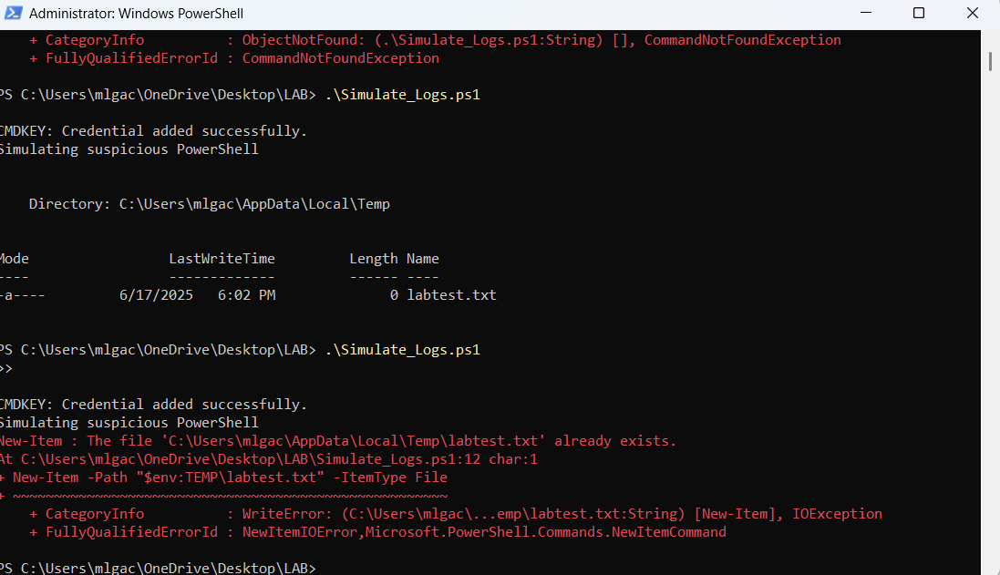

# 🛡️ offline-sysmon-log-analysis--lab

Offline Windows Sysmon lab for log analysis and MITRE technique simulation.

---

## 📸 Screenshots

### 💻 PowerShell Simulation Execution

> This shows the simulation script running, triggering PowerShell activity and generating event log data using Sysmon.
### 🧾 Sysmon Event ID 1 – Process Creation (XML View)

> This event shows a simulated malicious PowerShell command (`cmdkey.exe`) being logged by Sysmon with full XML details, including parent process, hashes, and integrity level.
